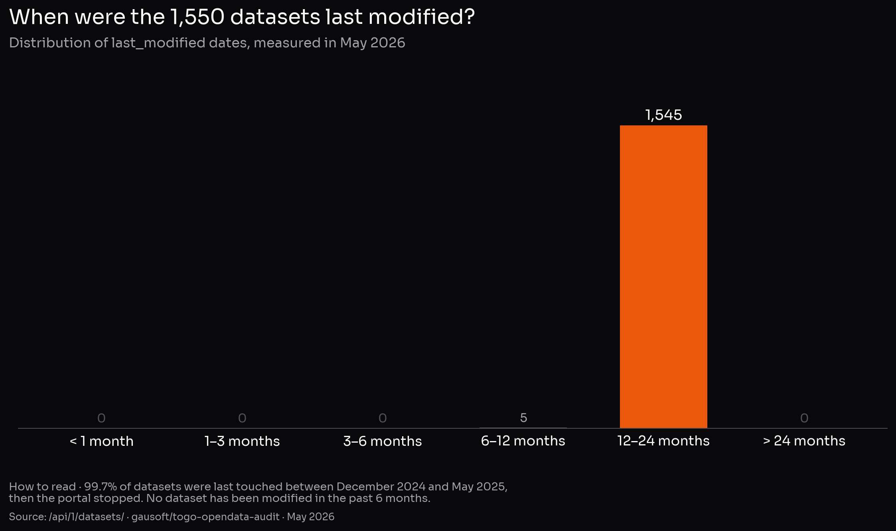
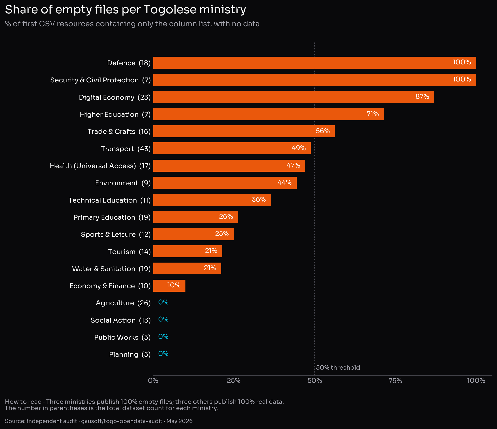

# Togo's open data: a portal that was installed, never put into service

**An independent quantitative audit and international benchmark of [opendata.gouv.tg](https://opendata.gouv.tg/fr/) and [geodata.gouv.tg](https://geodata.gouv.tg)**

> Independent report — May 2026
> Author: [@gausoft](https://github.com/gausoft) (Lomé, Togo)
> Methodology and raw data: [github.com/gausoft/togo-opendata-audit](https://github.com/gausoft/togo-opendata-audit)
> Licence: CC-BY 4.0

---

## Executive summary

**As of May 2026, the official contact card of Togo's national geoportal lists "Claudius Ptolemaeus, Chief Geographer, Alexandria, Roman Empire" as the responsible person.** This is not a joke: it is the unedited factory placeholder shipped with the software, deployed years ago and never changed. The anecdote captures the diagnosis of this audit in a single image — Togo's open data was *installed*, never *operated*.

On paper, Togo has everything it needs: a public portal ([opendata.gouv.tg](https://opendata.gouv.tg/fr/)) running on **udata** — the same open-source software that powers France's [data.gouv.fr](https://www.data.gouv.fr/) —, a cartographic geoportal ([geodata.gouv.tg](https://geodata.gouv.tg)) backed by an institutional **GeoServer**, and 1,550 published datasets. The tools are in place. The international standards that would make them usable (Open Data Charter, FAIR principles, the DCAT exchange format) have existed for a decade and are, for the most part, free to switch on.

This independent audit, conducted on **100% of the 1,550 published datasets** and cross-referenced with **ten peer portals** (France, UK, Kenya, Ghana, Côte d'Ivoire, Senegal, Rwanda, Burkina Faso, Nigeria, Benin), reveals a striking gap between appearance and substance. Five numbers anchor the diagnosis:

1. **The Ministries of the Armed Forces (18 datasets) and Security (7) publish 100% empty files** — only the column list, with no data rows. The Ministry of Digital Economy, whose core mission this should be, reaches **87% empty files**. By contrast, the Ministry of Agriculture and INSEED publish over 99% real data: **the problem is neither technical nor budgetary — it plays out administration by administration.**

2. **According to the official counters returned by the portal itself: 0 views, 0 downloads, 0 reuses, 0 discussions, 13 registered user accounts in total.** For comparison, data.gouv.fr (same software) records 64 million annual views.

3. **99.7% of datasets have not been modified in over 12 months.** The portal works as a frozen snapshot, not as a living service.

4. The geoportal [geodata.gouv.tg](https://geodata.gouv.tg) only exposes **a single map layer** through the open standard protocols. All other layers visible on screen flow through a private, undocumented API — invisible to global GIS tools (QGIS, ArcGIS).

5. **Among the eleven portals compared, Togo is the only one that has neither signed the Open Data Charter nor joined the Open Government Partnership.** Benin, Burkina Faso, Côte d'Ivoire, Ghana, Kenya, Nigeria and Senegal are all members.

None of these findings reflect a lack of resources: *udata* and *GeoServer* are free and open source, and the same software stack publishes 50× more datasets in France, refreshed daily. **The gap is organisational, not technological.**

This report documents every figure, places it against measurable international norms, and concludes with **ten actionable recommendations** — three of them activatable in a few hours, with no recruitment and no additional budget.

---

## 1. Methodology

### 1.1 Sources

| Source | Method | Volume |
|--------|--------|-------:|
| Metadata for all 1,550 datasets | `GET /api/1/datasets/?page_size=100` paginated | 1,550 records |
| Content sampling | First 32 KB of the 1st CSV resource of each dataset | 1,550 inspections |
| Aggregate portal metrics | `GET /api/1/site/` | official counters |
| Standards endpoints (DCAT-AP, OAI-PMH, RSS) | HTTP HEAD probes | 9 endpoints tested |
| Geoportal OGC | `GetCapabilities` on WMS, WFS, WMTS, WCS, CSW + OGC API | 8 endpoints tested |
| Normative frameworks | Open Data Charter, DCAT-AP 3.0, FAIR, Open Definition 2.1, EU Open Data Maturity, ODIN, OECD OURdata | dedicated dossier in repo |
| Country comparison | Direct retrieval of public counters from 10 peer portals | May 2026 |

### 1.2 Classification

Each downloaded resource is classified using a strict heuristic:

| Category | In plain English | Technical criterion |
|----------|------------------|---------|
| `data_tabular` | Real tabular data | At least 2 lines after the header, header not matching the schema-only pattern |
| `data_geo` | Real geolocated data | Same, plus `geometry`, `lat`, `lon` or equivalent column |
| `schema_only` | Only the column list, no data | Header matches `No., Nom du champ, Question, Description, Type du champ` |
| `empty` | Empty file | Less than 30 bytes or 1 line |
| `non_csv`, `http_4xx`, `no_resource` | Marginal cases | HTTP error, unexpected format, or missing resource |

The code is fully public: `scripts/03_content_audit.py` in the repository.

### 1.3 Limitations

- The audit examines the **first CSV resource** of each dataset. 193 datasets have 2+ resources; for 12, the first is a schema-only file and the second contains real data. The raw count of 114 schema-only datasets is therefore corrected to **102 / 1,550 = 6.6%** of *purely* schema-only datasets — this net figure is the one used throughout the report.
- Only the first 32 KB of each resource is fetched — enough to distinguish a schema dictionary from a real tabular file, not enough to assess full-file completeness.
- International indices (ODIN, GDB) do not systematically cover Togo; reported values are the most recent publicly accessible.

---

## 2. Mapping the opendata.gouv.tg portal

### 2.1 Volume

- **1,550 datasets** published, **1,829 files** (1.18 resources per dataset).
- **42 organisations** registered as data producers; **12 of them have published 0 datasets**, including key ministries: Territorial Planning, Maritime Economy and Coastal Protection, Urbanism and Housing, Rural Roads, Communications and Media, Territorial Administration, Foreign Affairs, Human Rights.
- **13 user accounts** registered across the entire portal (source: `/api/1/site/`).

### 2.2 Where the data actually comes from

| Producer | Datasets | Share |
|----------|---------:|------:|
| World Bank (re-publication of macro indicators) | 733 | **47.3%** |
| INSEED (Togo's national statistics institute) | 479 | **30.9%** |
| Humanitarian Data Exchange | 38 | 2.5% |
| All Togolese ministries combined | 287 | **18.5%** |
| Other (CEGA, Kaggle, OECD, individuals) | 13 | 0.8% |

**Reading.** 78% of the portal consists of World Bank indicators or INSEED series, both of which are already available elsewhere. Stripping that base, Togo's purely ministerial production shrinks to **287 datasets** — an order of magnitude comparable to Ghana's [data.gov.gh](https://data.gov.gh/) (271 catalogues) or Côte d'Ivoire's [data.gouv.ci](https://data.gouv.ci/) (177 datasets). "Headline volume" and "actual administrative production" are two different things.

### 2.3 Format

| Format | Files | Share |
|--------|------:|------:|
| CSV | 1,820 | **99.5%** |
| XLSX | 5 | 0.3% |
| XLS | 2 | 0.1% |
| PNG | 1 | 0.05% |
| ZIP | 1 | 0.05% |

**Reading.** No GeoJSON, no JSON, no Parquet, no RDF, no exposed API as a "resource". On [Tim Berners-Lee's 5★ scale](https://5stardata.info/en/) — a standard ranking that measures how technically open a dataset is, from ★ (any-format file under an open licence) up to ★★★★★ (data linked to other datasets across the semantic web) — every Togolese dataset caps at **★★★** (open non-proprietary CSV). No resource carries a reusable web identifier (URI), so none reach ★★★★.

### 2.4 Licence

| Licence | Datasets | Share |
|---------|---------:|------:|
| CC-BY-4.0 | 763 | 49.2% |
| `other-open` (generic, unspecific) | 748 | 48.3% |
| `notspecified` | 26 | 1.7% |
| `other-closed` | 9 | 0.6% |
| Other (CC-BY-SA, CC-BY-NC, PDDL, NC) | 4 | 0.3% |

**Reading.** ~99% of datasets are published under an open or presumed-open licence. **This is a real strength** compared to peer African portals where licence statements are often missing. The caveat: 48% carry the `other-open` label, which is not a recognised standard identifier (such as SPDX) — a federation harvester cannot validate it without human inspection, breaking principle **FAIR R1.1** ("data accompanied by a clear and accessible licence" — FAIR stands for *Findable, Accessible, Interoperable, Reusable*, the four criteria that make a dataset usable by anyone other than its producer).

---

## 3. Freshness — a systemic problem

### 3.1 The portal was produced in a single burst



The oldest `last_modified` date is **December 2024**, the most recent **October 2025**. Not a single dataset was touched in the six months preceding the audit. **The portal operates as a dated snapshot, not as a continuous flow.**

### 3.2 The frequency declaration commits no one

| Declared `frequency` | Datasets | Share |
|----------------------|---------:|------:|
| `irregular` | 1,297 | **83.7%** |
| `annual` | 243 | 15.7% |
| `monthly` | 3 | 0.2% |
| `daily` | 2 | 0.1% |
| Other (`punctual`, `bimonthly`, `quarterly`, `triennial`, `quinquennial`) | 5 | 0.3% |

DCAT recognises `irregular` as a valid value — but the [EU HVD regulation 2023/138](https://eur-lex.europa.eu/EN/legal-content/summary/open-data-and-the-reuse-of-public-sector-information.html) and Neumaier et al.'s [ACM 2016 quality framework](https://dl.acm.org/doi/10.1145/2964909) treat any dataset older than **2× its declared periodicity** as **formally outdated by its own rules**. A dataset declared `annual` and untouched for more than 12 months falls into that bucket — which describes all 243 `annual` datasets on the Togolese portal.

### 3.3 Nobody uses it (according to the portal itself)

Counters returned by the official `/api/1/site/` endpoint at audit time:

```json
{
  "datasets": 1550, "resources": 1829, "organizations": 42, "users": 13,
  "discussions": 0, "followers": 0, "harvesters": 0,
  "max_dataset_followers": 0, "max_dataset_reuses": 0, "max_org_followers": 0,
  "reuses": 0, "max_reuse_datasets": 0, "max_reuse_followers": 0
}
```

**Reading.** As of May 2026, the portal itself reports 0 views, 0 downloads, 0 reuses, 0 discussions, and 13 registered users in total — across 1,550 datasets and 42 organisations.

Two interpretations are possible: (a) the metrics instrumentation is disabled — in which case the portal does not know what it is delivering — or (b) it is active and nobody is using the portal. Either reading leads to the same conclusion: **there is currently no measurable feedback loop between data producers and users**.

For comparison, [data.gouv.fr](https://www.data.gouv.fr/) displays **64 million views** and **5.1 million downloads** annually on its homepage (May 2026).

---

## 4. Content quality — the core problem

### 4.1 The "schema-only" pattern

A significant share of datasets on opendata.gouv.tg follow an anti-pattern documented in the metadata-quality literature ([Frictionless Data 2020](https://frictionlessdata.io/blog/2020/04/23/table-schema-catalog/), [Neumaier et al. ACM JDIQ 2016](https://dl.acm.org/doi/10.1145/2964909)): **publishing the column dictionary of a dataset instead of the data itself**.

Concretely, a file `tours-telecoms.csv`, advertised as "the geolocated coordinates of telecom towers in Togo", contains on opening:

```
No.,Nom du champ,Question,Description,Type du champ
1,region_nom_bdd,,xsd:string,string
2,prefecture_nom_bdd,,xsd:string,string
3,commune_nom_bdd,,xsd:string,string
[...]
```

That is, 57 lines describing what the schema would be, and zero rows of data. For such a dataset to become usable, the agency would also need to publish the underlying table (`file-tours-telecoms-...csv`). For half of the affected datasets, that second file does not exist.

### 4.2 Distribution

Across all **1,550 datasets**, classification of the first CSV resource (*):

| Classification | N | % |
|----------------|--:|--:|
| `data_tabular` — real tabular data | 1,293 | 83.4% |
| `data_geo` — real geolocated data | 134 | 8.6% |
| `schema_only` — column list only | 114 | 7.4% |
| `non_csv` / HTTP error / no resource | 9 | 0.6% |

(*) Adjusted for the 12 multi-resource datasets where the second resource holds the real data, the net count of **purely** schema-only datasets is **102 / 1,550 = 6.6%**. This net figure is the one used throughout the rest of the report.

### 4.3 Distribution by ministry is highly uneven

The pattern is not uniformly distributed — it is extraordinarily concentrated in specific administrations:



For reference, **INSEED** (479 datasets) and the **World Bank** (733 datasets) both publish more than 99% real data — they are not on the chart because they are not Togolese ministries, but they prove that **clean publication is technically achievable** in the Togolese context. By contrast, the Ministries of Armed Forces, Security, Digital Economy and Higher Education publish mostly empty dictionaries. The diagnosis is therefore not "the portal is hollow" but "**some administrations published their templates instead of their data**".

### 4.4 Concrete cases

| Dataset title | Promise | Reality on download |
|---------------|---------|---------------------|
| `Tours Télécoms au Togo` | Locations of telecom towers | 57 lines describing columns, **0 towers** |
| `Établissements de Finance` | Geolocated list | Schema only |
| `Postes d'Eau Autonomes (PEA)` | Inventory of standalone water posts | Schema only |
| `Établissements des Mines Concessionées` | Mining sites | Schema only |
| `Accidents de la Circulation` | Detailed road-accident records | 28 nationally aggregated rows, 2014–2022, **no geolocation** |
| `Agences de la CEET` | Customer offices of the national electricity utility | ✅ 34 offices, 100% geolocated |
| `Tourisme - Hôtels au Togo` | Hotels of Togo | ✅ 1,259 hotels, 100% geolocated, realistic regional spread |

The gap between the last two cases (excellent) and the first ones (empty) shows that **good output is achievable with the same tools**; what is missing is a quality-validation step before publication.

---

## 5. The geoportal (geodata.gouv.tg)

### 5.1 Architecture

[geodata.gouv.tg](https://geodata.gouv.tg) is a React + Leaflet single-page application backed by two services:

- `https://api.geodata.gouv.tg/` — proprietary business API
- `https://geoserver.geoportail.gouv.tg/` — institutional GeoServer instance

The SPA's JavaScript bundle exposes the following endpoints: `/get_couche_data`, `/get_couche_metadata`, `/get_couche_glimpse`, `/get_couche_file`, `/regions`, `/prefectures`, `/cantons`, `/communes`, `/dashboard/load`, `/dashboard/prepare`, `/qna/load`, `/qna/interpret`. None of these are publicly documented — a third-party developer must manually reverse-engineer the minified bundle to use them.

### 5.2 OGC compliance

The [Open Geospatial Consortium](https://www.ogc.org/) standards are the "universal power sockets" of a geoportal: they let any GIS tool (QGIS, ArcGIS, gdal) plug in. **WMS** serves map backgrounds, **WFS** serves downloadable vector data, **WMTS** serves pre-rendered tiles, **WCS** serves rasters, **CSW** serves the layer catalogue, and **OGC API** is the modern REST version of all of the above. Probe results on `GetCapabilities`:

| Standard | Status | Finding |
|----------|--------|---------|
| **WMS 1.3.0** | ✅ HTTP 200 | Valid Capabilities. **One single layer** publicly listed: `prise_freely_available:togo_hex_raster_v2_low_res_100000`. Default service metadata (cf. § 5.3) |
| **WFS 2.0.0** | ❌ HTTP 401 Unauthorized | Vector download service inaccessible without authentication. **Contrary to the spirit of open data** |
| **WMTS 1.0.0** | ❌ HTTP 404 | Tile service not enabled |
| **WCS 2.0.1** | ✅ HTTP 200 | Coverage service active (limited utility without WFS) |
| **CSW 2.0.2** | ❌ HTTP 404 | **Metadata catalogue not exposed** — no automated discovery possible |
| **OGC API – Features / Maps / Styles** | ❌ HTTP 404 | Modern REST APIs not enabled |

### 5.3 The service contact card is the factory install

Verbatim excerpt from the WMS GetCapabilities returned by the Togolese public service:

```xml
<ContactInformation>
  <ContactPersonPrimary>
    <ContactPerson>Claudius Ptolomaeus</ContactPerson>
    <ContactOrganization>OSGeo</ContactOrganization>
  </ContactPersonPrimary>
  <ContactPosition>Chief Geographer</ContactPosition>
  <ContactAddress>
    <City>Alexandria</City>
    <StateOrProvince>Egypt</StateOrProvince>
    <Country>Roman Empire</Country>
  </ContactAddress>
  <ContactElectronicMailAddress>
    claudius.ptolomaeus@mercury.olympus.gov
  </ContactElectronicMailAddress>
</ContactInformation>
```

This is the placeholder shipped by default with GeoServer ([source](https://github.com/geoserver/geoserver)) — Claudius Ptolemaeus was a 2nd-century Greco-Roman geographer based in Alexandria. **The instance was deployed, brought online, and the contact card was never configured.** It is the digital equivalent of a public building handed over with the manufacturer's "showroom" sign still hanging at the entrance — and left there for years.

### 5.4 Sub-conclusion

Measured against open international standards, Togo's geoportal exposes **a single public raster layer** and locks its vector data behind undocumented authentication. All other content visible in the GUI flows through a private, non-standardised API. **The geoportal is, as it stands, not interoperable with the global GIS ecosystem.**

---

## 6. International standards conformance

### 6.1 Open Data Charter

The [International Open Data Charter (ODC)](https://opendatacharter.org/) is the most cited normative reference for government open data. Its [six principles](https://opendatacharter.org/principles/) — *Open by Default, Timely and Comprehensive, Accessible and Usable, Comparable and Interoperable, For Improved Governance and Citizen Engagement, For Inclusive Development and Innovation* — are endorsed by **174 governments** including 29 national ones ([adopters list](https://opendatacharter.org/government-adopters/)).

**Togo is not on the list.** In sub-Saharan Africa, only Sierra Leone is a signatory. This absence is not symbolic detail: principle 2 ("*Timely and Comprehensive — release high-quality open data in a timely manner, without undue delay*") is precisely the one mechanically violated by a portal whose 99.7% of content has not moved in sixteen months.

### 6.2 Open Government Partnership

The [Open Government Partnership (OGP)](https://www.opengovpartnership.org/) gathers states that commit to **biennial National Action Plans** on transparency and open data. African members: Benin, Burkina Faso, Cabo Verde, Côte d'Ivoire, Ghana, Kenya, Liberia, Malawi, Morocco, Nigeria, Senegal, Seychelles, Sierra Leone, South Africa, Tunisia, Zambia. That is **all comparable countries except Rwanda and Togo**.

Togo passed the OGP Values Check assessment but never formalised membership, despite a 2018 public invitation. Practical consequence: **no published open-data action plan, no civil-society engagement cycle on the topic, no multilateral accountability**.

### 6.3 DCAT-AP — the missing interoperability standard

**DCAT** is the standard format that lets two open-data portals automatically exchange their catalogues, with no human re-typing anything. [DCAT v3](https://www.w3.org/TR/vocab-dcat-3/) became a W3C Recommendation in August 2024; the European profile [DCAT-AP 3.0](https://semiceu.github.io/DCAT-AP/releases/3.0.0/) is used by 27 national portals to federate their catalogues on [data.europa.eu](https://data.europa.eu/en/). The udata software, which powers both opendata.gouv.tg and data.gouv.fr, **natively exposes** a DCAT-AP feed at `/catalog.xml` and `/catalog.json`.

| Endpoint | data.gouv.fr | opendata.gouv.tg |
|----------|--------------|------------------|
| `/catalog.xml` (DCAT RDF/XML) | ✅ HTTP 200 | ❌ **HTTP 404** |
| `/catalog.json` (DCAT JSON-LD) | ✅ HTTP 200 | ❌ **HTTP 404** |
| `/.well-known/dcat-ap.xml` | ✅ | ❌ HTTP 404 |
| `/api/1/site/quality` (udata's native quality scoring) | ✅ | ❌ HTTP 404 |

The native features exist in the code — they are not enabled. Consequence: **no third-party tool (data.europa.eu, DCAT-AP harvester, Validata) can automatically harvest the Togolese portal** ("harvest" = automatically copy the catalogue at regular intervals, with no human in the loop). Activation is a udata configuration parameter.

### 6.4 5★ Linked Open Data

Tim Berners-Lee's [5★ ladder](https://5stardata.info/) ranks datasets in five cumulative levels:

- ★ document under open licence, any format
- ★★ structured machine-readable document
- ★★★ structured **non-proprietary** format (CSV, JSON, etc.)
- ★★★★ use of **URIs** to identify entities
- ★★★★★ links to other open datasets (Linked Data)

opendata.gouv.tg assessment:

- 99.5% of files are open CSV → most of the portal reaches **★★★** (which is fine).
- No resource exposes a reusable URI, ships a `tableschema.json`, or links to other RDF datasets → **no dataset reaches ★★★★ or ★★★★★**.

This is the standard level of most government portals worldwide; Togo is not behind here. The next step up — exemplified by [data.europa.eu](https://data.europa.eu/en/) and parts of [data.gov.uk](https://www.data.gov.uk/) — is not yet started.

### 6.5 FAIR — quick self-assessment

| Principle | Togo status |
|-----------|-------------|
| **F**indable — persistent IDs, indexed metadata | ⚠️ udata slugs present but no DOIs, no CSW/DCAT federation |
| **A**ccessible — standard, open protocols | ⚠️ HTTP/HTTPS yes, OGC partial, DCAT absent |
| **I**nteroperable — shared vocabularies | ❌ No documented controlled vocabularies, formats limited to CSV |
| **R**eusable — provenance, clear licence, community standards | ⚠️ Clear licence on 99% (strength), provenance documented, but 6.6% of datasets without real data |

### 6.6 International indices and rankings

| Index | Togo score | Reading |
|-------|-----------:|---------|
| **ODIN 2024** (Open Data Inventory, Open Data Watch) | **55 / 100** — rank 95/198 | Just above the global median (50.9). Sub-scores: Coverage 55, Openness 54. Source: [ODIN homepage](https://odin.opendatawatch.com/) — SPA site, navigate to "Country Profiles" → Togo → 2024. Raw JSON archived in this repo: [`data/raw/odin_tgo_2024.json`](https://github.com/gausoft/togo-opendata-audit/blob/main/data/raw/odin_tgo_2024.json). |
| **Open Data Barometer 4th edition (2017)** | 16 / 100 — rank 81/115 | Last edition covering Togo. The successor (Global Data Barometer) does not systematically include the country |
| **Global Data Barometer 2nd edition (2025)** | not publicly indexed | Pull directly from [globaldatabarometer.org/explore](https://globaldatabarometer.org/explore-the-results/) |
| **UN E-Government Survey 2024 — OGDI** | not publicly indexed | Pull from [publicadministration.un.org/egovkb](https://publicadministration.un.org/egovkb/en-us/) |
| **Open Data Charter signatory** | ❌ No | |
| **OGP member** | ❌ No | |
| **EU Open Data Maturity** | n/a (non-EU) | |

---

## 7. Regional comparison

Condensed table built from public portal counters and official registries (May 2026, sources in `data/processed/international-benchmarks.md`):

| Country | Portal | Software | Datasets | Last update | Formats | API | OGP | ODC |
|---------|--------|----------|---------:|-------------|---------|----|----|----|
| **France** | data.gouv.fr | udata | **74,000** | daily | CSV, JSON, GeoJSON, Parquet, XLSX | ✅ REST + DCAT | ✅ | ✅ |
| **United Kingdom** | data.gov.uk | CKAN | ~30,000 | active | CSV, JSON, XML, Shapefile | ✅ | ✅ | ✅ |
| **Kenya** | opendata.go.ke | ArcGIS Hub | n.a. | reviving | CSV, KML, GeoJSON, GeoTIFF | ✅ ArcGIS REST | ✅ | ❌ |
| **Ghana** | data.gov.gh | CKAN | 271 catalogues / 912 resources | n.a. | n.a. | ✅ CKAN | ✅ | ❌ |
| **Côte d'Ivoire** | data.gouv.ci | proprietary | 177 / 124,357 records | n.a. | n.a. | n.a. | ✅ | ❌ |
| **Senegal** | distributed (geosenegal, ANSD…) | various | n.a. (not aggregated) | varies | CSV, JSON | partial | ✅ | ❌ |
| **Rwanda** | statistics.gov.rw + RISA | NSIR + CKAN | n.a. | regular (NISR) | CSV, XLSX | ✅ | ❌ | ❌ |
| **Burkina Faso** | data.gov.bf (BODI) | CKAN | "200+" + 35 recent (PAGOF 2024) | irregular | varies | ✅ CKAN | ✅ | ❌ |
| **Nigeria** | data.gov.ng | CKAN | n.a. | sectoral | CSV, XLSX | ✅ CKAN | ✅ | ❌ |
| **Benin** | data.gouv.bj | CKAN | unreachable (May 2026) | n.a. | JSON, CSV, Excel | 3 public APIs | ✅ | ❌ |
| **Togo** | opendata.gouv.tg | **udata** | **1,550** | **frozen since Dec 2024** | **99.5% CSV** | exposed but DCAT off | ❌ | ❌ |

**Key takeaways:**

1. **Togo is ~50× smaller than France on identical software.** The gap is organisational.
2. **Togo's headline volume is several times larger than Ghana's or Côte d'Ivoire's**, but both are OGP members publishing open-data action plans — raw quantity without governance is a misleading maturity metric.
3. **Across the eleven portals compared, Togo is the only one in neither OGP nor ODC.** A singular outlier.
4. **udata, Togo's chosen platform, natively exposes DCAT-AP, OAI-PMH, and a self-quality endpoint — none are switched on.**

---

## 8. Synthetic diagnosis

Three findings frame the gap between appearance and reality of Togo's setup:

### 8.1 The portal was produced, not put into operation

The initial investment — choice of robust open-source software (udata), deployment, first batch of 1,500 datasets — clearly reflects a one-shot project, likely supported by an external technical partner: the concentration of update dates inside a narrow few-month window (December 2024 – October 2025), followed by total silence, is the signature of a project delivery, not a continuous service. **The transition from delivery to daily operation — the "operational phase" — never happened.** None of the native features that would lend the portal credibility (DCAT-AP, `/site/quality`, harvesters, usage metrics) have been enabled. No update cycle has been initiated.

### 8.2 Publication quality depends on the producer, not on the portal

Three ministries publish 100% real data (Agriculture, Public Works, Planning). Three others publish 100% empty dictionaries (Armed Forces, Security, and de facto Digital Economy at 87%). **The portal has no quality gate before publication.** A simple automated check — "does this CSV have more than N rows?" — would have prevented 100 empty datasets from going live.

### 8.3 The geoportal exposes less than it contains

The private API `/get_couche_*` appears to back several dozen layers in the geodata.gouv.tg interface. But the only standardised, open door (WMS) exposes a single one. The WFS service, which would let a GIS user download a vector file, is password-protected — without any public documentation on how to obtain access. **A meaningful share of Togo's geographic data is technically published but practically inaccessible.**

---

## 9. Recommendations

Ranked by implementation effort — from quickest to most structural. None require external funding; all are within reach of existing skills in the ecosystem (Ministry of Digital Economy team, INSEED, GIZ/World Bank partners).

### Quick wins (days)

1. **Activate the native DCAT-AP feed in udata** (`catalog.xml`, `catalog.json`). Native software setting — no custom development required. Immediate effect: the portal becomes harvestable by data.europa.eu and any DCAT harvester.
2. **Activate the `/site/quality` endpoint** of udata. Effect: a public per-organisation quality scoreboard, an intrinsic accountability mechanism.
3. **Configure the GeoServer service profile**: replace Claudius Ptolomaeus with the Ministry of Digital Economy's contact details. Ten minutes.

### Short term (weeks)

4. **Audit and republish the schema-only datasets** — 102 cases identified in `data/processed/content_audit_rows.json`, concentrated in 4–5 ministries. Either retract the dataset or publish the data file that should have accompanied it.
5. **Publicly document the geoportal's API** (`/get_couche_data` et al.) or migrate to udata's standard API. Without this, local Togolese developers (Lomé, Atakpamé) cannot access the data.
6. **Open the WFS service** for at least anonymous read access on layers declared as open. This is the precondition for GIS interoperability.

### Medium term (quarter)

7. **Publish an update frequency policy**: per theme, set the minimum periodicity (annual for demographics, monthly for electricity production, quarterly for budget). Encode these commitments in producer-portal agreements.
8. **Set up a CI validation script for pre-publication** (Frictionless Data, Validata) rejecting CSVs below a completeness threshold. An empty dataset should not be publishable.
9. **Activate user metrics** (views, downloads, follows) and expose them on the portal. Without usage signals, no priority arbitrage is possible.

### Structural (year)

10. **Initiate Open Government Partnership accession** (12–18-month cycle) and Open Data Charter signature. Both processes are free and align Togo with regional commitments. Drafting a first National Action Plan mechanically forces the mapping of stakeholders (administrations, civil society, press, private sector) who currently do not gather around data.

---

## 10. Audit limitations and call for correction

This audit was conducted in May 2026 by an independent actor, on public data only, with open tooling and fully documented scripts. **All factual corrections are welcome and will be integrated.**

- Collection and analysis scripts are released under MIT licence at: [github.com/gausoft/togo-opendata-audit](https://github.com/gausoft/togo-opendata-audit)
- Raw data (1,550 metadata records + per-resource classification) is released under CC-BY 4.0 in the same repository
- The report can be re-executed in under 15 minutes by anyone with Python 3 and an internet connection

If an administration wishes to flag an error, an undetected recent update, or contribute a correction, the author commits to integrating it in a v1.1 of the report. GitHub provides public traceability of amendments.

The intent of this publication is explicitly **constructive**. Togo holds real assets — a free, modern state platform; an INSEED that publishes cleanly at scale; an open licence on most of the portal. Activating ten configuration parameters and republishing one hundred files would, within a quarter, transform Togo's standing on international rankings and, more importantly, the actual value of what Togolese administrations make available to their ecosystem.

---

## Appendices

### A. Raw sources

Every figure cited in this report is traceable to one of the following files:

| File | Content |
|------|---------|
| `data/raw/datasets_metadata.json` | 1,550 complete udata records |
| `data/processed/metadata_analysis.json` | Aggregates (formats, licences, frequencies, freshness) |
| `data/processed/content_audit.json` | Per-resource classification + per-organisation stats |
| `data/processed/content_audit_rows.json` | Per-dataset detail |
| `data/processed/international-benchmarks.md` | International reference dossier (ODC, DCAT, FAIR, OGP, indices) |

### B. Reproduce the audit

```bash
git clone https://github.com/gausoft/togo-opendata-audit.git
cd togo-opendata-audit
python3 scripts/01_fetch_metadata.py     # ~3 min
python3 scripts/02_analyze_metadata.py   # < 5 s
python3 scripts/03_content_audit.py      # ~14 min
```

### C. Author and contact

- **[@gausoft](https://github.com/gausoft)** — independent author based in Lomé, Togo
- Flag a correction or contribute: [GitHub issues](https://github.com/gausoft/togo-opendata-audit/issues)

---

*Report released under CC-BY 4.0. Cite as:* @gausoft (2026). *Independent audit of Togo's open data portal.* GitHub: gausoft/togo-opendata-audit.
