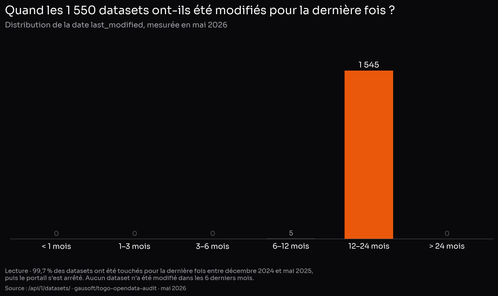
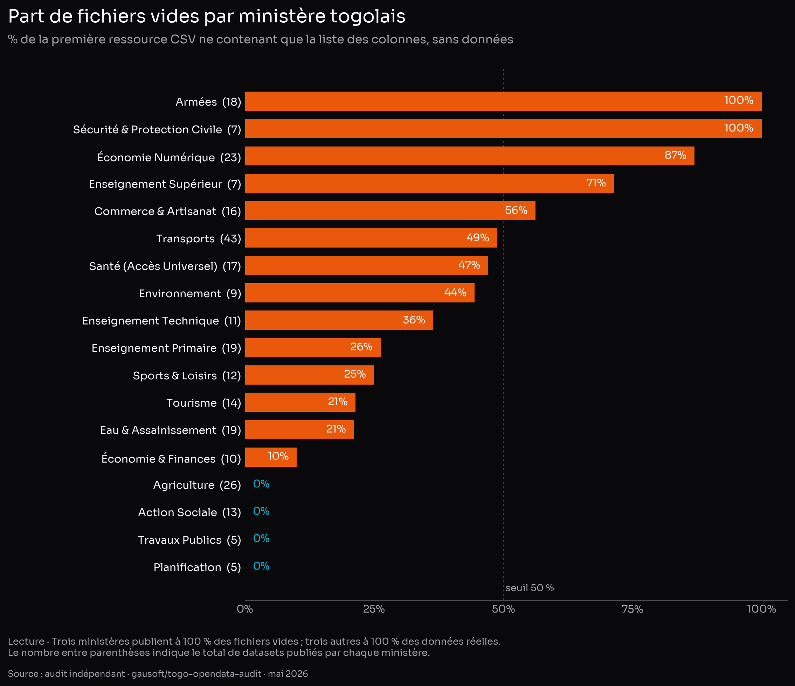

# Open data togolais : un portail installé, jamais mis en service

**Audit indépendant chiffré et benchmark international des portails [opendata.gouv.tg](https://opendata.gouv.tg/fr/) et [geodata.gouv.tg](https://geodata.gouv.tg)**

> Rapport indépendant — mai 2026
> Auteur : [@gausoft](https://github.com/gausoft) (Lomé, Togo)
> Méthodologie et données brutes : [github.com/gausoft/togo-opendata-audit](https://github.com/gausoft/togo-opendata-audit)
> Licence : CC-BY 4.0

---

## Résumé exécutif

**En mai 2026, la fiche officielle du géoportail de l'État togolais désigne comme responsable « Claudius Ptolémée, géographe en chef, Alexandrie, Empire romain ».** Ce n'est pas une blague : c'est le texte par défaut, jamais modifié, du logiciel installé il y a plusieurs années. Cette anecdote résume à elle seule le diagnostic de cet audit — l'open data togolais a été *installé*, jamais *exploité*.

Le Togo dispose pourtant, sur le papier, de tout : un portail public ([opendata.gouv.tg](https://opendata.gouv.tg/fr/)) propulsé par **udata** — le même logiciel libre que [data.gouv.fr](https://www.data.gouv.fr/) —, un géoportail cartographique ([geodata.gouv.tg](https://geodata.gouv.tg)) adossé à un **GeoServer** institutionnel, et 1 550 jeux de données publiés. Les outils sont là. Les standards internationaux qui les rendraient utilisables (Open Data Charter, principes FAIR, format d'échange DCAT) existent depuis dix ans et sont, pour la plupart, gratuits à activer.

Cet audit indépendant, mené sur **100 % des 1 550 datasets** publiés et croisé avec **dix portails comparables** (France, Royaume-Uni, Kenya, Ghana, Côte d'Ivoire, Sénégal, Rwanda, Burkina Faso, Nigeria, Bénin), révèle un écart frappant entre l'apparence et la substance. Cinq chiffres pour fixer le diagnostic :

1. **Les ministères des Armées (18 datasets) et de la Sécurité (7) publient à 100 % des fichiers vides** — uniquement la liste des colonnes, sans aucune ligne de données. Le Ministère de l'Économie Numérique, dont c'est pourtant le cœur de métier, atteint **87 % de fichiers vides**. À l'inverse, le Ministère de l'Agriculture et l'INSEED publient à plus de 99 % des données réelles : **le problème n'est ni technique, ni budgétaire — il se joue administration par administration.**

2. **Selon les compteurs officiels renvoyés par le portail lui-même : 0 vue, 0 téléchargement, 0 réutilisation, 0 discussion, 13 comptes utilisateurs enregistrés au total.** À titre de comparaison, data.gouv.fr (même logiciel) totalise 64 millions de vues annuelles.

3. **99,7 % des jeux de données n'ont pas été modifiés depuis plus de 12 mois.** Le portail fonctionne comme une photographie figée, pas comme un service vivant.

4. Le géoportail [geodata.gouv.tg](https://geodata.gouv.tg) n'expose qu'**un seul fond de carte** par les protocoles ouverts standards. Le reste des couches visibles à l'écran transite par une API privée non documentée — invisible aux outils SIG mondiaux (QGIS, ArcGIS).

5. **Sur les onze portails comparés, le Togo est le seul à n'avoir signé ni l'Open Data Charter ni adhéré à l'Open Government Partnership.** Bénin, Burkina Faso, Côte d'Ivoire, Ghana, Kenya, Nigeria et Sénégal y sont tous.

Aucun de ces constats ne tient à un manque de moyens : *udata* et *GeoServer* sont libres et gratuits, et la même infrastructure logicielle publie 50 fois plus de données en France et les met à jour quotidiennement. **L'écart est organisationnel, pas technologique.**

Ce rapport documente chaque chiffre, le situe par rapport aux normes internationales mesurables, et conclut sur **dix recommandations actionnables** — dont trois activables en quelques heures, sans recrutement et sans budget supplémentaire.

---

## 1. Méthodologie

### 1.1 Sources

| Source | Méthode | Volume |
|--------|---------|-------:|
| Métadonnées des 1 550 datasets de opendata.gouv.tg | `GET /api/1/datasets/?page_size=100` paginé | 1 550 enregistrements |
| Échantillonnage du contenu | Téléchargement des 32 premiers KB de la 1ʳᵉ ressource CSV de chaque dataset (1 550) | 1 550 inspections |
| Métriques agrégées du portail | `GET /api/1/site/` | renvoie compteurs officiels |
| Endpoints standards (DCAT-AP, OAI-PMH, RSS) | sondes HTTP HEAD | 9 endpoints testés |
| Géoportail OGC | `GetCapabilities` sur WMS, WFS, WMTS, WCS, CSW + OGC API | 8 endpoints testés |
| Référentiels normatifs | Open Data Charter, DCAT-AP 3.0, FAIR, Open Definition 2.1, EU Open Data Maturity, ODIN, OECD OURdata | dossier dédié dans le repo |
| Comparaison pays | Récupération directe des compteurs publics de 10 portails pairs | mai 2026 |

### 1.2 Classification utilisée

Chaque ressource téléchargée est classée selon une heuristique stricte :

| Catégorie | En clair | Critère technique |
|-----------|----------|---------|
| `data_tabular` | Vraies données | Au moins 2 lignes après l'en-tête, en-tête non identifié comme dictionnaire |
| `data_geo` | Vraies données géolocalisées | Idem, et l'en-tête contient un champ `geometry`, `lat`, `lon` ou équivalent |
| `schema_only` | Uniquement la liste des colonnes, aucune donnée | L'en-tête correspond au pattern `No., Nom du champ, Question, Description, Type du champ` |
| `empty` | Fichier vide | Moins de 30 octets ou 1 ligne |
| `non_csv`, `http_4xx`, `no_resource` | Cas marginaux | Erreur HTTP, format imprévu, ou ressource absente |

Le code est intégralement public : `scripts/03_content_audit.py` dans le dépôt.

### 1.3 Limites

- L'audit examine la **première ressource CSV** de chaque dataset. 193 datasets ont 2 ressources ou plus ; pour 12 d'entre eux, la 1ʳᵉ est un schéma et la 2ᵉ contient les données. Le chiffre brut de 114 datasets schema-only est donc corrigé à **102 / 1 550 = 6,6 %** de datasets *purement* schema-only — c'est ce chiffre net qui est retenu dans tout le rapport.
- L'audit ne télécharge que les 32 premiers KB de chaque ressource — suffisant pour distinguer un schéma vide d'une vraie donnée tabulaire, insuffisant pour juger l'exhaustivité d'un fichier.
- Les indices internationaux (ODIN, GDB) ne couvrent pas tous le Togo systématiquement ; les valeurs reportées sont les plus récentes accessibles publiquement.

---

## 2. Cartographie du portail opendata.gouv.tg

### 2.1 Volumétrie

- **1 550 datasets** publiés, **1 829 fichiers** (1,18 ressource par dataset).
- **42 organisations** déclarées comme productrices ; **12 d'entre elles ont 0 dataset publié**, dont des ministères clés : Aménagement du Territoire, Économie Maritime et Protection Côtière, Urbanisme et Habitat, Désenclavement et Pistes Rurales, Communication et Médias, Administration Territoriale, Affaires Étrangères, Droits de l'Homme.
- **13 comptes utilisateurs** enregistrés sur l'ensemble du portail (source : `/api/1/site/`).

### 2.2 D'où viennent réellement les données

| Producteur | Datasets | Part |
|------------|---------:|-----:|
| Banque Mondiale (re-publication d'indicateurs macro) | 733 | **47,3 %** |
| INSEED | 479 | **30,9 %** |
| Humanitarian Data Exchange | 38 | 2,5 % |
| Ensemble des ministères togolais | 287 | **18,5 %** |
| Autres (CEGA, Kaggle, OCDE, individuels) | 13 | 0,8 % |

**Lecture** : 78 % du portail est constitué d'indicateurs Banque Mondiale ou de séries INSEED, déjà disponibles ailleurs. Si l'on retire ce socle, la production purement ministérielle togolaise se réduit à **287 datasets** — un ordre de grandeur comparable à celui des portails ghanéen (271 catalogues sur [data.gov.gh](https://data.gov.gh/)) ou ivoirien (177 datasets sur [data.gouv.ci](https://data.gouv.ci/)). Le « volume affiché » et la « production administrative réelle » sont deux choses différentes.

### 2.3 Format

| Format | Fichiers | Part |
|--------|---------:|-----:|
| CSV | 1 820 | **99,5 %** |
| XLSX | 5 | 0,3 % |
| XLS | 2 | 0,1 % |
| PNG | 1 | 0,05 % |
| ZIP | 1 | 0,05 % |

**Lecture** : aucun GeoJSON, aucun JSON, aucun Parquet, aucun RDF, aucune API exposée comme « ressource ». À l'aune de [l'échelle 5★ de Tim Berners-Lee](https://5stardata.info/en/) — un classement standard qui mesure le degré d'« ouverture technique » d'un jeu de données, de ★ (PDF sous licence ouverte) à ★★★★★ (données reliées entre elles sur le web sémantique) —, tous les datasets togolais plafonnent à **★★★** (CSV non-propriétaire). Aucune ressource ne porte d'identifiant web réutilisable (URI), donc aucune n'atteint ★★★★.

### 2.4 Licence

| Licence | Datasets | Part |
|---------|---------:|-----:|
| CC-BY-4.0 | 763 | 49,2 % |
| `other-open` (générique non-spécifique) | 748 | 48,3 % |
| `notspecified` | 26 | 1,7 % |
| `other-closed` | 9 | 0,6 % |
| Autres (CC-BY-SA, CC-BY-NC, PDDL, NC) | 4 | 0,3 % |

**Lecture** : ~99 % des datasets sont publiés sous une licence ouverte ou présumée telle. C'est **un point fort réel** par rapport aux portails africains pairs où la mention de licence est souvent absente. Le bémol : 48 % portent l'étiquette `other-open`, qui n'est pas un identifiant standard reconnu (type SPDX) — un automate de fédération ne peut donc pas la valider sans inspection humaine, ce qui contrevient au principe **FAIR R1.1** (« données accompagnées d'une licence claire et accessible » — FAIR désigne les quatre critères *Findable, Accessible, Interoperable, Reusable* qui rendent une donnée utilisable par d'autres que son producteur).

---

## 3. La fraîcheur — un problème systémique

### 3.1 Tout le portail a été produit en une seule rafale



La date de dernière modification la plus ancienne est **décembre 2024**, la plus récente **octobre 2025**. Aucun dataset n'a été touché dans les six mois précédant l'audit. **Le portail fonctionne comme un instantané daté, pas comme un flux.**

### 3.2 La déclaration de fréquence n'engage personne

| `frequency` déclaré | Datasets | Part |
|---------------------|---------:|-----:|
| `irregular` | 1 297 | **83,7 %** |
| `annual` | 243 | 15,7 % |
| `monthly` | 3 | 0,2 % |
| `daily` | 2 | 0,1 % |
| Autres (`punctual`, `bimonthly`, `quarterly`, `triennial`, `quinquennial`) | 5 | 0,3 % |

Le vocabulaire DCAT reconnaît `irregular` comme valeur valide — mais la [norme européenne HVD (UE 2023/138)](https://eur-lex.europa.eu/EN/legal-content/summary/open-data-and-the-reuse-of-public-sector-information.html) et l'auditeur de [Neumaier et al. (ACM 2016)](https://dl.acm.org/doi/10.1145/2964909) considèrent qu'au-delà de **deux fois la périodicité déclarée**, un dataset est **formellement périmé selon ses propres règles**. Un dataset déclaré `annual` mais non touché depuis plus de 12 mois entre dans ce cas — soit la totalité des 243 datasets `annual` du portail togolais.

### 3.3 Personne ne s'en sert (selon le portail lui-même)

Compteurs renvoyés par l'endpoint officiel `/api/1/site/` au moment de l'audit :

```json
{
  "datasets": 1550, "resources": 1829, "organizations": 42, "users": 13,
  "discussions": 0, "followers": 0, "harvesters": 0,
  "max_dataset_followers": 0, "max_dataset_reuses": 0, "max_org_followers": 0,
  "reuses": 0, "max_reuse_datasets": 0, "max_reuse_followers": 0
}
```

**Lecture** : à mai 2026, le portail déclare lui-même 0 vue, 0 téléchargement, 0 réutilisation, 0 discussion, et 13 comptes utilisateurs au total — pour 1 550 jeux de données et 42 organisations.

Deux interprétations possibles : (a) l'instrumentation des métriques est désactivée — auquel cas le portail ne sait pas ce qu'il diffuse — ou (b) elle est active et personne n'utilise effectivement le portail. Les deux hypothèses appellent la même conclusion : **il n'y a pas, aujourd'hui, de boucle de retour mesurable entre les producteurs de données et leurs utilisateurs**.

À titre de comparaison, [data.gouv.fr](https://www.data.gouv.fr/) affiche en page d'accueil **64 millions de vues** et **5,1 millions de téléchargements** annuels (mai 2026).

---

## 4. La qualité du contenu — le problème principal

### 4.1 Le pattern « schema-only »

Une part significative des datasets publiés sur opendata.gouv.tg suit un anti-pattern documenté par la littérature de qualité métadonnées ([Frictionless Data 2020](https://frictionlessdata.io/blog/2020/04/23/table-schema-catalog/), [Neumaier et al. ACM JDIQ 2016](https://dl.acm.org/doi/10.1145/2964909)) : **publier le dictionnaire des colonnes du dataset à la place des données elles-mêmes**.

Concrètement, un fichier `tours-telecoms.csv` annoncé comme « les coordonnées géolocalisées des tours télécoms du Togo » contient, à l'ouverture :

```
No.,Nom du champ,Question,Description,Type du champ
1,region_nom_bdd,,xsd:string,string
2,prefecture_nom_bdd,,xsd:string,string
3,commune_nom_bdd,,xsd:string,string
[...]
```

Soit 57 lignes décrivant ce que serait le schéma de la donnée, et zéro ligne de donnée. Pour qu'un dataset de ce type devienne réellement utile, l'organisme devrait également publier la table sous-jacente (le fichier `file-tours-telecoms-...csv`). Pour la moitié des datasets affectés, ce second fichier n'existe pas dans la collection.

### 4.2 Distribution des cas

Sur les **1 550 datasets** audités, classification de la première ressource CSV (*) :

| Classification | N | % |
|----------------|--:|--:|
| `data_tabular` — vraies données tabulaires | 1 293 | 83,4 % |
| `data_geo` — vraies données géolocalisées | 134 | 8,6 % |
| `schema_only` — uniquement la liste des colonnes | 114 | 7,4 % |
| `non_csv` / erreur HTTP / sans ressource | 9 | 0,6 % |

(*) Après correction pour les 12 datasets multi-ressources où la 2ᵉ ressource contient les données réelles, le chiffre net de datasets **purement** schema-only est **102 / 1 550 = 6,6 %**. C'est ce chiffre net qui est retenu dans le reste du rapport.

### 4.3 La répartition par ministère est très inégale

Le pattern n'est pas uniformément distribué — il est extraordinairement concentré sur certaines administrations :



À titre de référence, **l'INSEED** (479 datasets) et la **Banque Mondiale** (733 datasets) publient toutes deux à plus de 99 % de données réelles — elles ne figurent pas sur le graphique car ce ne sont pas des ministères togolais, mais elles démontrent que **la publication propre est techniquement atteignable** dans le contexte togolais. À l'inverse, les ministères des Armées, de la Sécurité, de l'Économie Numérique et de l'Enseignement Supérieur publient majoritairement des dictionnaires sans contenu. Le diagnostic n'est donc pas « le portail est creux » mais « **certaines administrations ont publié leurs maquettes au lieu de leurs données** ».

### 4.4 Cas concrets

| Titre du dataset | Promesse | Réalité au téléchargement |
|------------------|----------|---------------------------|
| `Données Ouvertes sur les Tours Télécoms au Togo` | Localisation des antennes | 57 lignes décrivant les colonnes, **0 antenne** |
| `Données Ouvertes sur les Établissements de Finance au Togo` | Liste géolocalisée | Schéma uniquement |
| `Données Ouvertes sur les Postes d'Eau Autonomes (PEA) au Togo` | Inventaire des PEA | Schéma uniquement |
| `Données Ouvertes sur les Établissements des Mines Concessionées au Togo` | Sites miniers | Schéma uniquement |
| `Données Ouvertes sur les Accidents de la Circulation Constatés par les Services de Police et de Gendarmerie au Togo` | Bilan détaillé des accidents | 28 lignes agrégées au niveau national, couverture 2014–2022, **aucune géolocalisation** |
| `Données Ouvertes sur les Agences de la CEET` | Agences clientèle de l'opérateur électrique | ✅ 34 agences, 100 % géolocalisées |
| `Données Ouvertes sur le Tourisme - Hôtels au Togo` | Hôtels du Togo | ✅ 1 259 hôtels, 100 % géolocalisés, distribution régionale réaliste |

L'écart entre les deux derniers cas (excellents) et les premiers (vides) montre que **le bon résultat est atteignable avec les mêmes outils** ; il manque une étape de validation qualité avant publication.

---

## 5. Le géoportail (geodata.gouv.tg)

### 5.1 Architecture

Le portail [geodata.gouv.tg](https://geodata.gouv.tg) est une SPA React + Leaflet, adossée à deux back-ends :

- `https://api.geodata.gouv.tg/` — API métier propriétaire
- `https://geoserver.geoportail.gouv.tg/` — instance GeoServer institutionnelle

Le bundle JavaScript de la SPA expose les endpoints suivants : `/get_couche_data`, `/get_couche_metadata`, `/get_couche_glimpse`, `/get_couche_file`, `/regions`, `/prefectures`, `/cantons`, `/communes`, `/dashboard/load`, `/dashboard/prepare`, `/qna/load`, `/qna/interpret`. Aucun de ces endpoints n'est documenté publiquement — un développeur tiers doit rétro-ingénierer le bundle minifié à la main pour les utiliser.

### 5.2 Conformité OGC

Les standards de l'[Open Geospatial Consortium](https://www.ogc.org/) sont les « prises électriques universelles » d'un géoportail : ils permettent à n'importe quel outil SIG (QGIS, ArcGIS, gdal, etc.) de se brancher dessus. **WMS** sert les fonds de carte, **WFS** les données vectorielles téléchargeables, **WMTS** les tuiles préparées, **WCS** les rasters, **CSW** le catalogue des couches, **OGC API** la version REST moderne de l'ensemble. Résultats des sondes `GetCapabilities` :

| Standard | Statut | Constat |
|----------|--------|---------|
| **WMS 1.3.0** | ✅ HTTP 200 | Capabilities valide. **1 seul layer** publiquement listé : `prise_freely_available:togo_hex_raster_v2_low_res_100000`. Métadonnées de service par défaut (cf. § 5.3) |
| **WFS 2.0.0** | ❌ HTTP 401 Unauthorized | Service de téléchargement vectoriel inaccessible sans authentification. **Contraire à l'esprit de l'open data** |
| **WMTS 1.0.0** | ❌ HTTP 404 | Service de tuiles non activé |
| **WCS 2.0.1** | ✅ HTTP 200 | Service de couvertures raster activé (utilité limitée sans WFS) |
| **CSW 2.0.2** | ❌ HTTP 404 | **Catalogue de métadonnées non exposé** — aucune découverte automatisée possible |
| **OGC API – Features / Maps / Styles** | ❌ HTTP 404 | Génération moderne d'API REST non activée |

### 5.3 La fiche d'identité du service est l'installation d'usine

Extrait verbatim du document `WMS GetCapabilities` renvoyé par le service public togolais :

```xml
<ContactInformation>
  <ContactPersonPrimary>
    <ContactPerson>Claudius Ptolomaeus</ContactPerson>
    <ContactOrganization>OSGeo</ContactOrganization>
  </ContactPersonPrimary>
  <ContactPosition>Chief Geographer</ContactPosition>
  <ContactAddress>
    <City>Alexandria</City>
    <StateOrProvince>Egypt</StateOrProvince>
    <Country>Roman Empire</Country>
  </ContactAddress>
  <ContactElectronicMailAddress>
    claudius.ptolomaeus@mercury.olympus.gov
  </ContactElectronicMailAddress>
</ContactInformation>
```

Il s'agit du placeholder par défaut livré dans le code source de GeoServer ([GitHub source](https://github.com/geoserver/geoserver)) — Claudius Ptolémée était un géographe gréco-romain d'Alexandrie au IIᵉ siècle. **L'instance a été déployée, mise en ligne, et la fiche n'a jamais été configurée.** Autrement dit : c'est l'équivalent numérique d'un bâtiment public livré avec encore le panneau « showroom » du fabricant à l'entrée — et qui le porte depuis des années.

### 5.4 Conclusion partielle

Le géoportail togolais publie, à l'aune des standards ouverts mondiaux, **un seul layer raster public**, et bloque ses données vectorielles derrière une authentification non documentée. Tout le reste du contenu visible sur l'interface graphique transite par une API privée non standardisée. **Le géoportail n'est, en l'état, pas interopérable avec l'écosystème SIG mondial.**

---

## 6. Conformité aux standards internationaux

### 6.1 Open Data Charter

L'[International Open Data Charter (ODC)](https://opendatacharter.org/) est la référence normative la plus citée en matière d'open data gouvernemental. Ses [six principes](https://opendatacharter.org/principles/) — *Open by Default, Timely and Comprehensive, Accessible and Usable, Comparable and Interoperable, For Improved Governance and Citizen Engagement, For Inclusive Development and Innovation* — sont signés par **174 gouvernements** dont 29 nationaux ([liste officielle](https://opendatacharter.org/government-adopters/)).

**Le Togo n'y figure pas**. En Afrique subsaharienne, seule la Sierra Leone est signataire. Cette absence n'est pas un détail symbolique : le principe 2 (« *Timely and Comprehensive — release high-quality open data in a timely manner, without undue delay* ») est précisément celui qui est mécaniquement violé par un portail dont 99,7 % du contenu n'a pas bougé depuis seize mois.

### 6.2 Open Government Partnership

L'[Open Government Partnership (OGP)](https://www.opengovpartnership.org/) regroupe les États qui s'engagent dans des **plans d'action nationaux biennaux** sur la transparence et l'open data. Membres africains : Bénin, Burkina Faso, Cabo Verde, Côte d'Ivoire, Ghana, Kenya, Liberia, Malawi, Maroc, Nigeria, Sénégal, Seychelles, Sierra Leone, Afrique du Sud, Tunisie, Zambie. Soit **tous les pays comparables sauf le Rwanda et le Togo**.

Le Togo a passé l'évaluation OGP Values Check mais n'a jamais formalisé son adhésion, malgré une invitation publique en 2018. La conséquence pratique : **aucun plan d'action open data publié, aucun cycle d'engagement avec la société civile sur le sujet, aucune redevabilité multilatérale**.

### 6.3 DCAT-AP — l'absence du standard d'interopérabilité

**DCAT** est le format standard qui permet à deux portails open data de s'échanger automatiquement leurs catalogues, sans qu'un humain ait à recopier quoi que ce soit. [DCAT v3](https://www.w3.org/TR/vocab-dcat-3/) est devenu une recommandation W3C en août 2024 ; son profil européen [DCAT-AP 3.0](https://semiceu.github.io/DCAT-AP/releases/3.0.0/) est utilisé par 27 portails nationaux pour fédérer leurs catalogues sur [data.europa.eu](https://data.europa.eu/en/). Le logiciel udata, qui propulse opendata.gouv.tg comme data.gouv.fr, **expose nativement** un flux DCAT-AP aux URL `/catalog.xml` et `/catalog.json`.

| Endpoint | data.gouv.fr | opendata.gouv.tg |
|----------|--------------|------------------|
| `/catalog.xml` (DCAT RDF/XML) | ✅ HTTP 200 | ❌ **HTTP 404** |
| `/catalog.json` (DCAT JSON-LD) | ✅ HTTP 200 | ❌ **HTTP 404** |
| `/.well-known/dcat-ap.xml` | ✅ | ❌ HTTP 404 |
| `/api/1/site/quality` (auto-évaluation udata) | ✅ | ❌ HTTP 404 |

Les fonctions natives existent dans le code — elles ne sont pas activées. Conséquence : **aucun outil tiers (data.europa.eu, harvester DCAT-AP, validateur Validata) ne peut moissonner automatiquement le portail togolais** (« moissonner » = recopier le catalogue automatiquement à intervalles réguliers, sans intervention humaine). Le coût d'activation est un paramètre de configuration udata.

### 6.4 5★ Linked Open Data

Le modèle de [Tim Berners-Lee](https://5stardata.info/) classe les datasets en cinq niveaux cumulatifs :

- ★ document publié sous licence ouverte, format quelconque
- ★★ document structuré et lisible par machine
- ★★★ document structuré au format **non-propriétaire** (CSV, JSON, etc.)
- ★★★★ utilisation d'**URI** pour identifier les entités
- ★★★★★ liens vers d'autres jeux de données ouvertes (Linked Data)

Évaluation opendata.gouv.tg :

- 99,5 % des fichiers sont en CSV ouvert → l'essentiel du portail atteint **★★★**, ce qui est correct.
- Aucune ressource n'expose d'URI réutilisable, ne porte de schéma `tableschema.json`, ni ne pointe vers d'autres datasets RDF → **aucun dataset n'atteint ★★★★ ni ★★★★★**.

C'est le niveau standard de la majorité des portails gouvernementaux mondiaux ; le Togo n'y est pas en retard. C'est en revanche la marche supérieure — celle qu'expérimentent par exemple [data.europa.eu](https://data.europa.eu/en/) ou [data.gov.uk](https://www.data.gov.uk/) sur certains datasets — qui n'est pas amorcée.

### 6.5 FAIR — auto-évaluation rapide

| Principe | Statut Togo |
|----------|-------------|
| **F**indable — identifiants persistants, métadonnées indexées | ⚠️ Identifiants présents (slugs udata) mais pas DOI, pas de fédération CSW/DCAT |
| **A**ccessible — protocoles standardisés, ouverts | ⚠️ HTTP/HTTPS oui, OGC partiel, DCAT absent |
| **I**nteroperable — vocabulaires partagés | ❌ Aucun vocabulaire contrôlé documenté, formats limités à CSV |
| **R**eusable — provenance, licence claire, standards communautaires | ⚠️ Licence claire à 99 % (point fort), provenance documentée, mais 6,6 % de datasets sans données réelles |

### 6.6 Indices et classements internationaux

| Indice | Score Togo | Lecture |
|--------|-----------:|---------|
| **ODIN 2024** (Open Data Inventory, Open Data Watch) | **55 / 100** — rang 95/198 | Juste au-dessus de la médiane mondiale (50,9). Sub-scores : Couverture 55, Ouverture 54. Source : [accueil ODIN](https://odin.opendatawatch.com/) — site SPA, sélectionner « Country Profiles » → Togo → 2024. JSON brut archivé dans ce dépôt : [`data/raw/odin_tgo_2024.json`](https://github.com/gausoft/togo-opendata-audit/blob/main/data/raw/odin_tgo_2024.json). |
| **Open Data Barometer 4ᵉ édition (2017)** | 16 / 100 — rang 81/115 | Dernière édition couvrant le Togo. Le successeur (Global Data Barometer) ne couvre pas systématiquement le pays |
| **Global Data Barometer 2ᵉ édition (2025)** | non documenté publiquement | À extraire directement depuis [globaldatabarometer.org/explore](https://globaldatabarometer.org/explore-the-results/) |
| **UN E-Government Survey 2024 — OGDI** | non documenté publiquement | À extraire de [publicadministration.un.org/egovkb](https://publicadministration.un.org/egovkb/en-us/) |
| **Open Data Charter signataire** | ❌ Non | |
| **OGP membre** | ❌ Non | |
| **EU Open Data Maturity** | n/a (hors UE) | |

---

## 7. Comparaison régionale

Tableau condensé établi à partir des compteurs publics des portails et des registres officiels (mai 2026, sources dans le dossier `data/processed/international-benchmarks.md`) :

| Pays | Portail | Logiciel | Datasets | Dernière maj | Formats | API | OGP | ODC |
|------|---------|----------|---------:|--------------|---------|----|----|----|
| **France** | data.gouv.fr | udata | **74 000** | quotidienne | CSV, JSON, GeoJSON, Parquet, XLSX | ✅ REST + DCAT | ✅ | ✅ |
| **Royaume-Uni** | data.gov.uk | CKAN | ~30 000 | active | CSV, JSON, XML, Shapefile | ✅ | ✅ | ✅ |
| **Kenya** | opendata.go.ke | ArcGIS Hub | n.c. | en relance | CSV, KML, GeoJSON, GeoTIFF | ✅ ArcGIS REST | ✅ | ❌ |
| **Ghana** | data.gov.gh | CKAN | 271 catalogues / 912 ressources | n.c. | n.c. | ✅ CKAN | ✅ | ❌ |
| **Côte d'Ivoire** | data.gouv.ci | propriétaire | 177 / 124 357 enregistrements | n.c. | n.c. | n.c. | ✅ | ❌ |
| **Sénégal** | écosystème distribué (geosenegal, ANSD…) | divers | n.c. (non agrégé) | varie | CSV, JSON | partiel | ✅ | ❌ |
| **Rwanda** | statistics.gov.rw + RISA | NSIR + CKAN | n.c. | régulière (NISR) | CSV, XLSX | ✅ | ❌ | ❌ |
| **Burkina Faso** | data.gov.bf (BODI) | CKAN | « 200+ » + 35 récents (PAGOF 2024) | irrégulière | varie | ✅ CKAN | ✅ | ❌ |
| **Nigeria** | data.gov.ng | CKAN | n.c. | sectoriel | CSV, XLSX | ✅ CKAN | ✅ | ❌ |
| **Bénin** | data.gouv.bj | CKAN | inaccessible (mai 2026) | n.c. | JSON, CSV, Excel | 3 APIs publiques | ✅ | ❌ |
| **Togo** | opendata.gouv.tg | **udata** | **1 550** | **gelée depuis janv. 2025** | **99,5 % CSV** | exposée mais DCAT off | ❌ | ❌ |

**Lectures principales** :

1. **Le Togo est ~50 fois plus petit que la France à logiciel identique.** Le gap est organisationnel.
2. **Le Togo est 5 à 10 fois plus volumineux que le Ghana et la Côte d'Ivoire**, mais ces deux pays sont membres OGP et publient des plans d'action open data — la quantité sans gouvernance est une fausse mesure de maturité.
3. **Sur les onze portails comparés, le Togo est le seul à n'être ni à l'OGP ni à l'ODC.** Singularité.
4. **udata, le logiciel togolais, expose nativement DCAT-AP, OAI-PMH et un endpoint qualité auto-évalué — aucun n'est activé.**

---

## 8. Diagnostic synthétique

Trois constats structurent l'écart entre l'apparence et la réalité du dispositif togolais :

### 8.1 Le portail a été produit, pas mis en service

L'investissement initial — choix d'un logiciel libre robuste (udata), déploiement, premier remplissage de 1 500 datasets — est manifestement la conséquence d'un projet ponctuel, probablement appuyé par un partenaire technique externe : la concentration des dates de mise à jour sur une seule fenêtre de quelques mois (décembre 2024 – octobre 2025), suivie d'un silence total, est la signature d'une livraison de projet, pas d'un service continu. **Le passage de la livraison au fonctionnement quotidien — la « phase d'exploitation » — n'a pas eu lieu.** Aucune des fonctions natives qui rendraient le portail crédible (DCAT-AP, `/site/quality`, harvesters, métriques d'usage) n'a été activée. Aucun cycle de mise à jour n'a été engagé.

### 8.2 La qualité des publications dépend du producteur, pas du portail

Trois ministères publient à 100 % de la donnée réelle (Agriculture, Travaux Publics, Planification). Trois autres publient à 100 % des dictionnaires sans données (Armées, Sécurité, et de fait Économie Numérique à 87 %). **Le portail n'a pas de garde-fou qualité avant publication.** Une simple vérification automatisée — « ce CSV a-t-il plus de N lignes ? » — aurait empêché 100 datasets vides de paraître.

### 8.3 Le géoportail expose moins de données que ce qu'il en contient

L'API privée `/get_couche_*` semble servir au moins quelques dizaines de couches dans l'interface de geodata.gouv.tg. Mais la seule porte standardisée et ouverte (WMS) en livre une seule. Le service WFS, qui permettrait à un utilisateur SIG de télécharger un fichier vectoriel, est protégé par mot de passe — sans documentation publique sur la procédure d'obtention. **Une partie significative de la donnée géographique togolaise est techniquement publiée mais pratiquement inaccessible**.

---

## 9. Recommandations

Classées par effort de mise en œuvre — du plus rapide au plus structurant. Aucune ne nécessite de financement externe ; toutes sont activables avec les compétences déjà présentes dans l'écosystème (équipe Min. Numérique, INSEED, partenaires GIZ/Banque Mondiale).

### Quick wins (jours)

1. **Activer le flux DCAT-AP natif d'udata** (`catalog.xml`, `catalog.json`). Paramètre de configuration natif du logiciel — aucun développement spécifique requis. Effet immédiat : portail moissonnable par data.europa.eu et tout harvester tiers.
2. **Activer l'endpoint `/site/quality`** d'udata. Effet : page publique de score qualité par organisation, mécanisme intrinsèque de redevabilité.
3. **Configurer la fiche de service du GeoServer** : remplacer Claudius Ptolomaeus par les coordonnées du Ministère de l'Économie Numérique. Dix minutes.

### Court terme (semaines)

4. **Auditer et republier les datasets schema-only** — 102 cas identifiés dans `data/processed/content_audit_rows.json`, concentrés sur 4-5 ministères. Soit retirer le dataset, soit publier le fichier de données qui aurait dû l'accompagner.
5. **Documenter publiquement l'API du géoportail** (`/get_couche_data` et al.) ou la migrer vers l'API standard udata. Sans cela, les développeurs locaux (Lomé, Atakpamé) n'ont pas accès aux données.
6. **Ouvrir le service WFS** au moins en lecture anonyme sur les couches déclarées open data. C'est la condition de l'interopérabilité SIG.

### Moyen terme (trimestre)

7. **Publier une politique de périodicité** : pour chaque thème, fixer la périodicité minimale (annuelle pour démographie, mensuelle pour production électrique, trimestrielle pour budget). Inscrire ces engagements dans les conventions producteur-portail.
8. **Mettre en place un script CI de validation pré-publication** (Frictionless Data, Validata) qui refuse les CSV sous un seuil de complétude. Un dataset vide ne devrait pas pouvoir être publié.
9. **Activer les métriques utilisateurs** (vues, téléchargements, suivi) et les exposer sur le portail. Sans signal d'usage, aucun arbitrage de priorité n'est possible.

### Structurant (année)

10. **Engager l'adhésion à l'Open Government Partnership** (cycle de 12-18 mois) et la signature de l'Open Data Charter. Les deux processus sont gratuits et alignent le Togo sur les engagements régionaux. La rédaction d'un premier National Action Plan oblige mécaniquement à cartographier les parties prenantes (administrations, société civile, presse, secteur privé) qui aujourd'hui ne se rencontrent pas autour des données.

---

## 10. Limites de l'audit et invitation à la correction

Cet audit a été conduit en mai 2026 par un acteur indépendant, sur des données publiques uniquement, avec des outils libres et des scripts entièrement documentés. **Toute correction factuelle est bienvenue et sera intégrée**.

- Les scripts de collecte et d'analyse sont publiés sous licence MIT à : [github.com/gausoft/togo-opendata-audit](https://github.com/gausoft/togo-opendata-audit)
- Les données brutes (1 550 fiches métadonnées + classification de chaque ressource) sont publiées sous CC-BY 4.0 dans le même dépôt
- Le rapport peut être réexécuté en moins de 15 minutes par toute personne disposant de Python 3 et d'un accès Internet

Si une administration souhaite signaler une erreur, une mise à jour récente non détectée, ou contribuer une correction, l'auteur s'engage à intégrer la mise à jour dans une version 1.1 du rapport. Le format GitHub permet une traçabilité publique des amendements.

L'intention de cette publication est explicitement **constructive**. Le Togo dispose d'atouts réels — un logiciel d'État libre et moderne, une INSEED qui sait publier proprement à l'échelle, une licence ouverte sur l'essentiel du portail. Activer dix paramètres de configuration et republier 100 fichiers transformerait, en un trimestre, la position du pays dans les classements internationaux et, plus important, la valeur effective de ce que les administrations togolaises mettent à disposition de leur écosystème.

---

## Annexes

### A. Sources brutes de cet audit

Chaque chiffre cité dans ce rapport est traçable dans l'un des fichiers suivants du dépôt :

| Fichier | Contenu |
|---------|---------|
| `data/raw/datasets_metadata.json` | 1 550 fiches udata complètes |
| `data/processed/metadata_analysis.json` | Agrégats (formats, licences, fréquences, fraîcheur) |
| `data/processed/content_audit.json` | Classification ressource-par-ressource + stats par organisation |
| `data/processed/content_audit_rows.json` | Détail par dataset |
| `data/processed/international-benchmarks.md` | Dossier de référence international (Open Data Charter, DCAT, FAIR, OGP, indices) |

### B. Reproduire l'audit

```bash
git clone https://github.com/gausoft/togo-opendata-audit.git
cd togo-opendata-audit
python3 scripts/01_fetch_metadata.py     # ~3 min
python3 scripts/02_analyze_metadata.py   # < 5 s
python3 scripts/03_content_audit.py      # ~14 min
```

### C. Auteur et contact

- **[@gausoft](https://github.com/gausoft)** — auteur indépendant basé à Lomé, Togo
- Signaler une correction ou contribuer : [GitHub issues](https://github.com/gausoft/togo-opendata-audit/issues)

---

*Rapport publié sous licence CC-BY 4.0. Citer en tant que :* @gausoft (2026). *Audit indépendant de l'open data togolais.* GitHub : gausoft/togo-opendata-audit.
